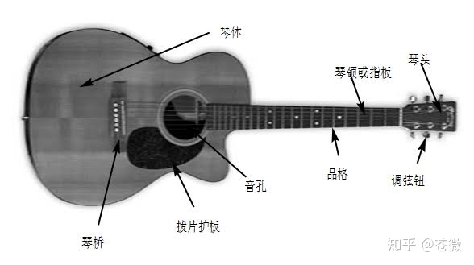
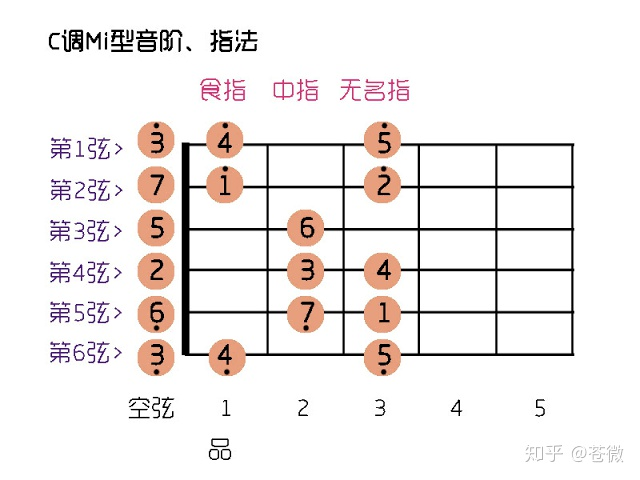

从双十一购买吉他，认识吉他，然后放家里落灰半年，后来拿起开始熟悉指法、品格、基本和弦，接着腾出空余时间，决心要好好自学，一开始坚持每周练，最后报班请老师指导，尽力做到每天练，中途因为出差有过短暂间断。现在虽然还没掌握好，弹唱还不熟练流畅，但也算是入门了吧。

下面就把平时整理的一些学习资料分享一下，也会穿插一些自己的经历和体会。

我的信息来源主要是知乎、bilibili 、youtube 和一些公众号。在知乎上主要搜索一些乐理、学习方法，bilibil 和 youtube 上会搜索一些教学视频，以及关注一些 up 主。

---

当你想要学吉他，一般会依次经历 选购 -> 认识 -> 练习 这样的过程。以下内容基于这个假设编排。

## 选购吉他

打算买一把吉他，一般就会想这些问题：

- 买什么样的？
- 什么价位的？
- 有哪些品牌可以选择？

[吉他如何选购以及新手如何入门？](https://www.zhihu.com/question/19696897)
​

可以参考看看上面这篇回答，除了品牌，解决了我前两个问题。

大概知道了吉他分为 **电吉他、古典吉他、民谣吉他** 这三种，关于板材的 **合板、面单、全单**

结论是：我要学民谣吉他，买个入门级面单吉他就Ok，买900以上的，900以内都是”烧火棍“。

至于品牌，我刚开始没有了解那么多，大概是京东、天猫、什么值得买上按”面单“、”吉他“、”入门“这些关键词搜索了下。然后趁双11降价，入手了一把。后来老师说我是，糟蹋了钱 。就是下面这款

[红棉吉他41寸初学者单板吉他入门40寸民谣男电箱面单学生女木吉他-tmall.com天猫](https://detail.tmall.com/item.htm?id=528234419975&spm=a1z09.2.0.0.56b72e8dxPCtW1&_u=p1u8h5f6406a&skuId=3210757075850)

重新看这边文章的时候，我又具体理解了下，以下部分的内容

- 音色 <- 共鸣 <- 震动损耗
- 面板：云杉、红松
- 背侧：玫瑰红、桃花心、沙比利、枫木
- 指板：玫瑰木、乌木
- 琴弦：011、012、013

## 认识吉他

吉他到手后，应该需要认识下各部分构成，及对应名称吧，看下面这张图应该够了

## 练习吉他

吉他有了，摸也摸过了，就需要想想怎么练了。刚到手时候是懵逼的，送的变调夹、调音器和拨片，都看不懂是些啥。不过我还是知道第一步需要调音，别问我为啥知道，就是朋友说的。

以下内容依次为

1. 调音
2. 手型
3. 爬格子
4. 音阶
5. 基本和弦
6. 乐理
7. 识谱

### 调音

[https://zh.wikihow.com/%E7%BB%83%E4%B9%A0%E5%90%89%E4%BB%96](https://zh.wikihow.com/%E7%BB%83%E4%B9%A0%E5%90%89%E4%BB%96)

可以看看上面这个，wikihow，这是吉他练到后面发现的网页，做为新手指导还是不错的。

要点包括

- 坐什么凳子
- 怎么抱住吉他
- 调音的三种办法（利用共振调音是后面才理解的，还没尝试过，文后会提到）
- 拨片用法（我还不大会）
- 等等

多次调音后，自然就记住了 EADGBe 六弦

### 手型

手型就是左手按弦和右手拨弦的方法和规范，包括左手各手指对应哪个品位，和右手各手指对应哪些弦。

[吉他初学者该如何入门？](https://www.zhihu.com/question/22693585)

上面的回答里有手型的文字讲解，但是建议通过视频来学习，可以上 bilibili 搜索。当你适应了之后，最好找人帮你看看，指出手型的错误，我报班刚上课的时候，老师就指出我的和弦手型不对。这方面建议要和别人多交流，一直闭门造车会养成坏的习惯。

### 爬格子

懂得手型之后，就可以开始练习爬格子了，通过爬格子来适应手的肌肉记忆，熟悉手指按在各个品位上发出的声音。

另外需要练习 53231323 来适应右手指法和感受节奏。

爬格子需要长期练习，初期重点用来熟悉手指动作。

下面关于爬格子的一些资料，可以放着以后慢慢看

[若宇：吉他大神必练的基本功！](https://zhuanlan.zhihu.com/p/78472909)

[练习爬格子对吉他手来说多重要?](https://www.zhihu.com/question/329468612)

### 音阶

熟悉了手的动作之后，早就迫不及待想要找出 do/re/mi/fa/sol/la/ti 了。可以试着看下面这张图

找出这7个音后，就可以自己来首《小星星》了。

为什么会是对应这些位置呢？这个时候就需要了解一点乐理知识了，回到前面看过的那篇入门回答

[吉他初学者该如何入门？](https://www.zhihu.com/question/22693585)

需要从里面理解半音、全音概念，并且记住6根弦对应的空弦音，就可以递推出来了。另外还能了解到怎么进行 **共振调音**

> 6弦5品对应5弦空弦，只要注意3弦四品对应2弦空弦，那我们调音是不是只需要调一根弦，剩下的就可以不接住调音器具了？

### 基本和弦

建议找视频来熟悉下一些简单和弦的弹法，甚至可以找喜欢的歌曲弹唱教学视频来熟悉，重点关注里面的和弦弹奏部分。这部分我看 阿澜吉他教室 的教学比较多，觉得讲解得简单清晰明白，她有公众号，youtube上也能搜到，估计b站也可以

会一些简单和弦后，又可以重点看些和弦方面的乐理了（如果前面没有仔细理解文章内关于和弦部分的话），就是根音、三音、五音这些概念。

熟悉一段时间后，差不多就可以去学歌了，如果还不会看六线谱的话，可以先去学习下识谱（识谱的内容还没有整理出来，回头我再补吧）

### 乐理

练习的同时，还得继续深挖一下乐理知识

[哎呀君：【耗时16h总结】最全最细致的吉他基础乐理干货](https://zhuanlan.zhihu.com/p/66028854)

[如何学好吉他乐理？](https://www.zhihu.com/question/56967922)

大体分为音程、音阶、和弦、节奏、指板五个部分，了解下？

[音乐中的do、re、mi都是怎么来的？](https://mp.weixin.qq.com/s/2wc3tHy66HIwMyQV-SCkAQ)

上面这个李老师的基础乐理视频，涉及十二平均律、五度相生法、三分损益法，讲的挺好的。

### 识谱

这部分后面再整理吧

### 其他

[初学吉他有哪些注意事项？](https://www.zhihu.com/question/59934656)

[迷鹿吉他尤克里里：吉他高手必会的七种调式，怎么理解最简单？](https://zhuanlan.zhihu.com/p/68968941)

[哎呀君：马上2020年了，再这样练琴你就把自己“毁”了！](https://zhuanlan.zhihu.com/p/96748368)

[若宇：吉他大神必练的基本功！](https://zhuanlan.zhihu.com/p/78472909)

---

以上就是我从零到入门搜集学习过的一些资料，其实还有很多通过视频学习的没有提到，后面会看情况尝试补充完整。有错误的地方请大家指正。
