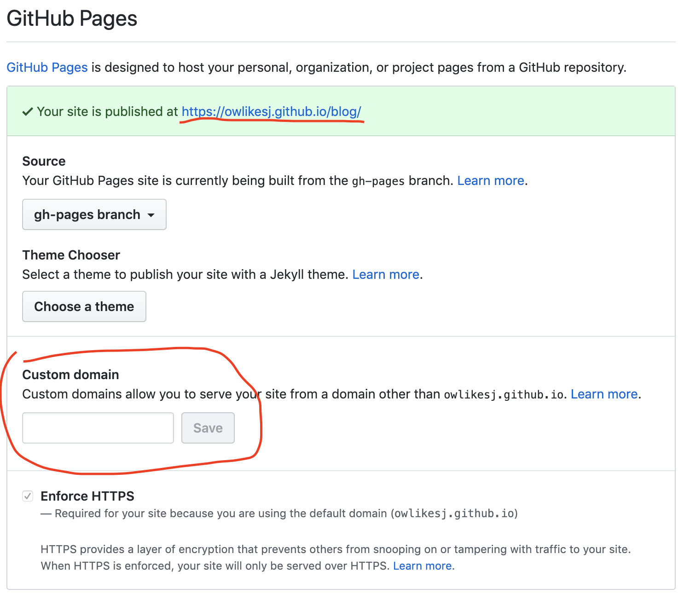
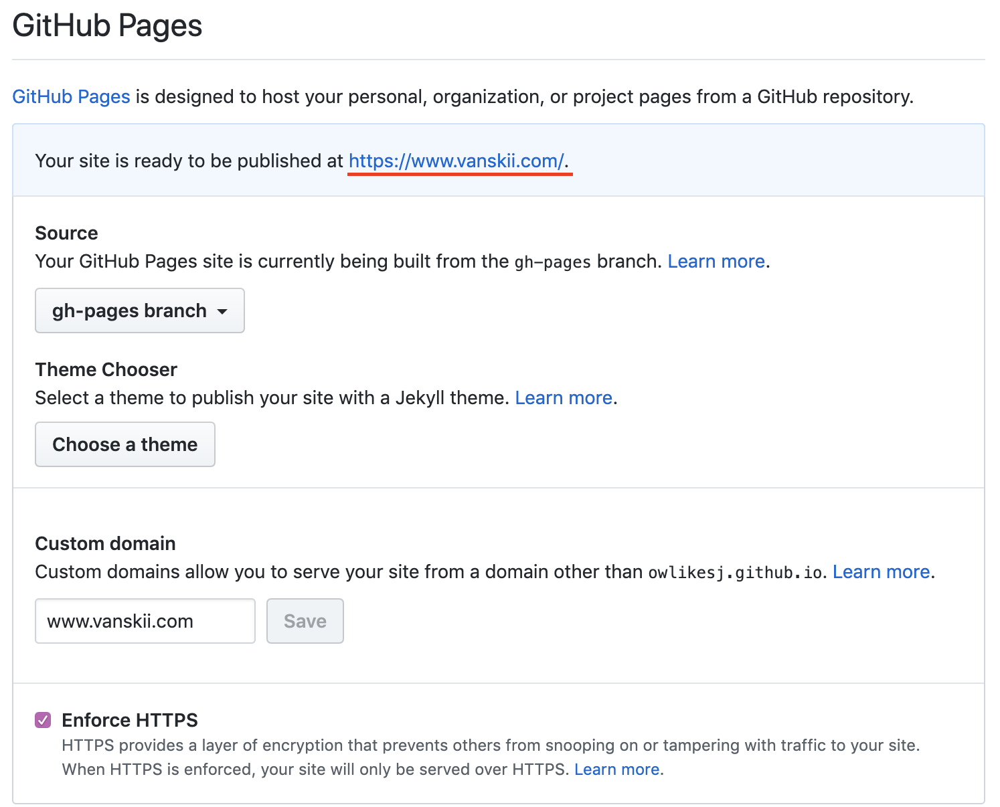
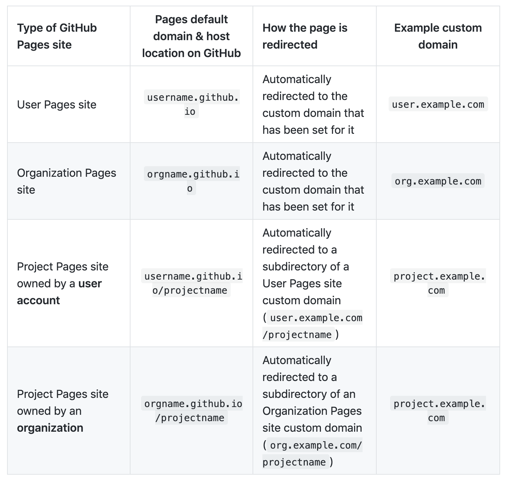

### 为什么要讲这个

在写好第一篇博文后，我就立即开始博客的部署了。

博客是使用 Gatsby 生成的，选用了 [gatsby-starter-lumen](https://www.gatsbyjs.org/starters/alxshelepenok/gatsby-starter-lumen/)，项目里提供的部署命令为 `gatsby build --prefix-paths && gh-pages -d public`，了解到部署 Github Pages 非常便利，所以决定先以这种方式上线。

但是部署后，自定义域名的过程中遇到了一些阻碍，折腾了一些时间后，才算搞明白。

### 自定义域名

当运行完部署命令之后，在 Github 上找到项目的 Settings 里的 GitHub Pages 设置，如下图：

可以看到，已经能通过 https://username.github.io/projectname 这样的链接进行访问了。并且，Custom domain 这一栏说明将它也配置好后，也可以通过自己的域名访问。

于是我点击了右边的 “Learn more” ，然后按照 [Setting up a www subdomain - GitHub Help](https://help.github.com/en/articles/setting-up-a-www-subdomain) 的说明进行了 配置（我配置的都是 www 的子域名）。实际上就是两步：

1.  配置 DNS 解析。添加一项 CNAME 配置，将 subdomain 映射到 username.github.io 。
2. 在项目 Settings 里保存自己的域名。在前面图中填入自己的 subdomain ，然后保存。

之后会发现，Settings 里这块区域变成了下图的样子（提示我可以用自己的域名访问了）。

是不是操作起来很简单 (*^__^*)

但~是~，我实际上是想通过 www.vanskii.com/blog 的形式进行访问，就像没有配置自己的域名之前，通过 username.github.io/blog 这样的子路径去访问，而不是域名的根路径。

那么有没有办法呢？要怎么配置呢？于是我又继续查看 Github 的帮助说明文档，折腾了一会，总算理解了。

### Github Pages

原来 Github 有两种 pages：*用户 pages* 和*项目 pages*。区别如下：

| pages类型 | 访问方式 | 项目名称 |
| :----------: | :----------: | :----------: |
| 用户 pages | username.github.io | username.github.io  （必须是这个） |
| 项目 pages | username.github.io/projectname | projectname  （路径名和项目名一致） |

所以，还需要有个 username.github.io 的项目，它也可以自定义域名。于是，我配置好 ”username.github.io“ 的自定义域名之后，再去查看 blog 项目的 Settings，发现里面提示我可以通过 https://www.vanskii.com/blog/ 去访问了，而且不需要再给项目配置域名。

上面这张表说的就是这个意思。但是我一开始没有看懂啊 _(:з」∠)_

总算是小功告成~ (*^__^*)
